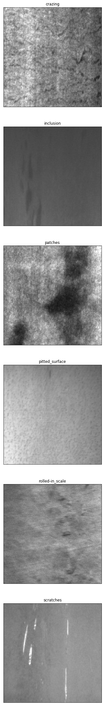
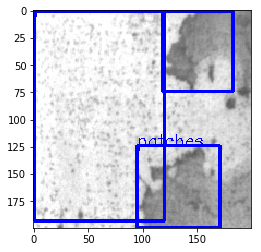
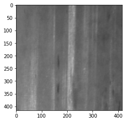
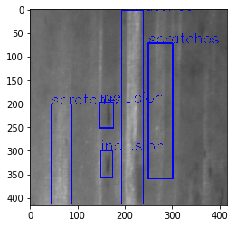
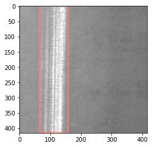
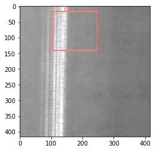

```python

!ls /home/aistudio/data
```

    data18746


```python

!unzip -oq -d  /home/aistudio/work/defectData /home/aistudio/data/data18746/NEU-DET.zip
```


```python
# 导入相关库
import paddle
import os
import shutil
import random
import numpy as np
import xml.etree.ElementTree as ET
import matplotlib.pyplot as plt
import cv2
import time
```

# 项目背景

**深度学习在工业应用中具有重要意义。**

**本项目以工业中真实表面缺陷数据训练缺陷检测模型。**

**最近刚开始入门学习目标检测模型YOLO系列，结合[AI达人创造营](https://aistudio.baidu.com/aistudio/education/group/info/24607)的学习内容，学习全流程自己搭建深度学习模型。**

# 数据集介绍

数据来自AIstudio公开数据集：[NEU-DET](https://aistudio.baidu.com/aistudio/datasetdetail/18746)

数据集包含了热轧钢带的六种表面缺陷：**['crazing', 'inclusion', 'patches', 'pitted_surface', 'rolled-in_scale', 'scratches']**

数据集包括 1800 张灰度图像：6 种不同类型的表面缺陷各有 300 个样本


**缺陷特征不是很明显，而且不同的缺陷有些相似。**


```python
# 获取缺陷名字
def get_defect_names(Dir_path,Images_Dir='IMAGES'):
    """
    return a list, as following,
        ['crazing',
         'inclusion',
         'patches',
         'pitted_surface',
         'rolled-in_scale',
         'scratches' ]
    """
    DEF_NAMES = []
    piclist = os.listdir(os.path.join(Dir_path, Images_Dir))
    for pic in piclist:
        picname = pic[0:pic.rfind("_")]
        if picname not in DEF_NAMES:
            DEF_NAMES.append(picname)

    return DEF_NAMES

f_Dir = 'work/defectData/NEU-DET'

DEF_NAMES = get_defect_names(f_Dir)
DEF_NAMES.sort()
print(DEF_NAMES)
```

    ['crazing', 'inclusion', 'patches', 'pitted_surface', 'rolled-in_scale', 'scratches']


```python
# 展示部分数据
def img_show(img, title='', cmap=None):
    fig = plt.imshow(img, interpolation='nearest', cmap=cmap)
    fig.axes.get_xaxis().set_visible(False)
    fig.axes.get_yaxis().set_visible(False)
    plt.title(title)

plt.figure(figsize=(40, 40))
for i in range(6):
    plt.subplot(6, 1, i + 1)
    fig = img_show(plt.imread(f'work/defectData/NEU-DET/IMAGES/{DEF_NAMES[i]}_{i+10}.jpg'), title=DEF_NAMES[i])
```





# 制作标签信息文档

首先转换原始标签信息，YOLO检测模型需要的真实框的标签信息是中心点坐标加宽高。

原始标签信息是左上角点坐标与右下角点坐标。

最后将信息保存在txt文档中。

如在labels文件夹下，有不同缺陷的标签数据。

**scratches_28.txt保存的是scratches_28.jpg的标签数据**


```python
def convert(size, box):  # 转换标签信息
    """
    将bbox的左上角点、右下角点坐标的格式，转换为中心点x,y + 宽高w,h的格式
    size：图片宽w，高h
    box：真实框信息，包含左上角点坐标与右下角点坐标
    返回归一化后的中心点坐标与宽高
    """
    dw = 1. / size[0]
    dh = 1. / size[1]
    x = (box[0] + box[1]) / 2.0 # 计算中心点x坐标
    y = (box[2] + box[3]) / 2.0 # 计算中心点y坐标
    w = box[1] - box[0]
    h = box[3] - box[2]
    x = x * dw  # 归一化
    w = w * dw
    y = y * dh
    h = h * dh
    return (x, y, w, h)  # 全部都已经归一化

def convert_annotation(image_id,f_Dir,Annotations_Dir='ANNOTATIONS',labels_Dir='labels'): # 转换坐标信息后并写入txt文档中
    """
    把图像image_id的xml文件转换为目标检测需要的label文件(txt)

    文件中记录的信息包含  物体的类别，归一化后的bbox的中心点点坐标  以及bbox的宽、高
    """
    in_file = open(f_Dir + '/'+Annotations_Dir+'/%s' % (image_id))
    image_id = image_id.split('.')[0]
    out_file = open(f_Dir+'/'+labels_Dir+'/%s.txt' % (image_id), 'w')  #  labels文件夹需要提前创建好
    tree = ET.parse(in_file)
    root = tree.getroot()
    size = root.find('size')
    w = int(size.find('width').text)
    h = int(size.find('height').text)

    for obj in root.iter('object'):
        difficult = obj.find('difficult').text
        cls = obj.find('name').text
        if cls not in DEF_NAMES or int(difficult) == 1:
            continue
        cls_id = DEF_NAMES.index(cls)
        xmlbox = obj.find('bndbox')
        points = (float(xmlbox.find('xmin').text), float(xmlbox.find('xmax').text), float(xmlbox.find('ymin').text),
             float(xmlbox.find('ymax').text))
        bb = convert((w, h), points)
        out_file.write(str(cls_id) + " " + " ".join([str(a) for a in bb]) + '\n')  # 写入信息


def make_label_txt(Dir_path, Annotations_Dir='ANNOTATIONS'):
    """在labels文件夹下创建image_id.txt文件，对应每个image_id.xml提取出的bbox信息"""
    filenames = os.listdir(os.path.join(Dir_path, Annotations_Dir))
    for filename in filenames:
        convert_annotation(filename,Dir_path)
```


```python
# 调用
make_label_txt(f_Dir)
```


```python
def show_labels_img(img_id, img_Dir='work/defectData/NEU-DET/IMAGES'): 
    """imgname是输入图像的名称"""
    img = cv2.imread(img_Dir+ '/' + img_id + ".jpg") # 读取图像
    img = cv2.cvtColor(img, cv2.COLOR_BGR2RGB) # 转换图像格式
    h, w = img.shape[:2] # 获取图像高宽
    print(w,h)
    label = []
    with open(f_Dir+"/labels/"+img_id+".txt",'r') as flabel: # 读取labels文件中的真实框信息
        for label in flabel:
            label = label.split(' ')
            label = [float(x.strip()) for x in label] # 读取后的信息为[11,0.332,0.588,0.12,0.09866666666666667] 都是归一化后的数值
            print(DEF_NAMES[int(label[0])]) # 获取类别信息
            pt1 = (int(label[1] * w - label[3] * w / 2), int(label[2] * h - label[4] * h / 2)) # 根据x,y,w,h，转换得到真实框的左上角点
            pt2 = (int(label[1] * w + label[3] * w / 2), int(label[2] * h + label[4] * h / 2)) # 根据x,y,w,h，转换得到真实框的右下角点
            cv2.putText(img,DEF_NAMES[int(label[0])],pt1,cv2.FONT_HERSHEY_SIMPLEX,0.5,(0,0,255))
            cv2.rectangle(img,pt1,pt2,(0,0,255),2)
    plt.imshow(img)
    plt.show()
```


```python
# 查看标签信息可视化
show_labels_img('pitted_surface_276')
```

    200 200
    pitted_surface
    patches
    patches





# 模型选择

已经有很多成熟的目标检测模型了，也有方便快速开发的套件[PaddleDetection](https://github.com/PaddlePaddle/PaddleDetection)

鉴于目前在学习YOLO网络，同时又有[AI达人创造营](https://aistudio.baidu.com/aistudio/education/group/info/24607)课程支持，便考虑自己搭建一个简单的目标检测模型。

**YOLOv2比YOLOv1要好，又比YOLOv3简单一些，搭建起来应该会快一点，于是选择YOLOv2模型。**

# 定义网络
## 网络结构

论文地址：[YOLO9000: Better, Faster, Stronger](https://arxiv.org/abs/1612.08242)

**YOLOv2的主干网络是 Darknet-19，在检测部分有一个passthrough层，这个层就是把Darknet-19中的3 × 3 × 512卷积层的输出拿出来，与最后第二个卷积层的输出进行通道上的融合。**

**下图是网络结构：**


## 搭建Darknet-19网络
**网络中使用的卷积层由三部分组成，分别是：Conv2D，Batch Normalization，LeakyReLU，可以先创建一个基础卷积类。**


```python
import paddle
import paddle.nn as nn

class CBL(nn.Layer):
    def __init__(self,C_input,C_output):
        super(CBL, self).__init__()
        self.conv_layer = nn.Sequential( nn.Conv2D(C_input, C_output, 3,stride=1, padding="SAME", bias_attr=False),  
                                         nn.BatchNorm2D(C_output),
                                         nn.LeakyReLU(negative_slope=0.1))
    def forward(self, x):
        x = self.conv_layer(x)
        return x

class Darknet19(nn.Layer):
    def __init__(self):
        super(Darknet19, self).__init__()
        self.maxpool = nn.MaxPool2D(kernel_size=2, stride=2, padding=0)
        self.conv_layer1 = CBL(3,32)
        self.conv_layer2 = CBL(32,64)
        self.conv_layer3 = nn.Sequential(CBL(64,128),CBL(128,64),CBL(64,128))
        self.conv_layer4 = nn.Sequential(CBL(128,256),CBL(256,128),CBL(128,256))
        self.conv_layer5 = nn.Sequential(CBL(256,512),CBL(512,256),CBL(256,512),CBL(512,256),CBL(256,512))
        self.conv_layer6 = nn.Sequential(CBL(512,1024),CBL(1024,512),CBL(512,1024),CBL(1024,512),CBL(512,1024))
    def forward(self, x):
        x = self.conv_layer1(x)
        x = self.maxpool(x)
        x = self.conv_layer2(x)
        x = self.maxpool(x)
        x = self.conv_layer3(x)
        x = self.maxpool(x)
        x = self.conv_layer4(x)
        x = self.maxpool(x)
        feature = self.conv_layer5(x)  # 用于后面的passthrough层
        x = self.maxpool(feature)
        x = self.conv_layer6(x)
        return x,feature 
```

## 搭建detection网络

**detection网络中包括了passthrough层，此层将高分辨率特征与低分辨率特征在通道上进行叠加，用以融合Fine-Grained Features（细粒度特性）。**


```python
# 定义检测网络
class Detection(nn.Layer):
    def __init__(self, num_anchor = 5, num_clas = 6, is_Conv = True):
        super(Detection, self).__init__()
        '''
        is_Conv：是否对feature进行通道缩减，如batchsize x 512 x 26 x26 --> batchsize x 64 x 26 x26
        '''
        self.num_anchor = num_anchor
        self.num_clas = num_clas
        self.is_conv = is_Conv
        self.conv_layer = CBL(1024,1024)
        self.conv_decrease_channel = CBL(512,64)
        self.passthrough = nn.Unfold([2, 2], strides=2, paddings=0)
        self.pred = nn.Conv2D(1024, self.num_anchor*(5+self.num_clas), (1, 1))  # 55=5*(5+6)
            
    def forward(self, x,feature):
        '''
        x：骨干网络Darknet19的最后输出特征图 batchsize x 1024 x 13 x13
        feature：用于进行特征融合的特征图 batchsize x 512 x 26 x26 
        '''
        x = self.conv_layer(x)  # 第一个Conv_layer
        x = self.conv_layer(x)  # 第二个Conv_layer
        # passthrough
        if self.is_conv:  
            feature = self.conv_decrease_channel(feature)
        # 数据重排
        _ , channel , h , w = feature.shape
        feature = self.passthrough(feature)
        feature = feature.reshape((-1, channel*4, h//2, w//2))
        # concatenates
        x = paddle.concat(x=[x, feature], axis=1)  

        x = CBL(x.shape[1],1024)(x)  # 第三个Conv_layer
        x = self.pred(x)
        return x
```


```python
class YOLOv2(nn.Layer):
    def __init__(self,scale = 32, is_Conv=True):
        super(YOLOv2, self).__init__()
        '''
        scale: 缩放比例，如一张416x416大小的图片，经过缩放后，变为13x13的特征图。
        is_Conv：在passthrough层中，是否对feature进行通道缩减，如batchsize x 512 x 26 x26 --> batchsize x 64 x 26 x26
        '''
        self.darknet = Darknet19()
        self.detection = Detection(is_Conv=is_Conv)
    def forward(self,x):
        x,feature = self.darknet(x)
        x = self.detection(x,feature)
        return x 
```


```python
# 查看YOLOv2网络
net = YOLOv2()
params_info = paddle.summary(net, (1, 3, 416, 416))
print(params_info)
```

    -------------------------------------------------------------------------------------------------------------
     Layer (type)                Input Shape                          Output Shape                  Param #    
    =============================================================================================================
       Conv2D-1              [[1, 3, 416, 416]]                     [1, 32, 416, 416]                 864      
     BatchNorm2D-1           [[1, 32, 416, 416]]                    [1, 32, 416, 416]                 128      
      LeakyReLU-1            [[1, 32, 416, 416]]                    [1, 32, 416, 416]                  0       
         CBL-1               [[1, 3, 416, 416]]                     [1, 32, 416, 416]                  0       
      MaxPool2D-1            [[1, 512, 26, 26]]                     [1, 512, 13, 13]                   0       
       Conv2D-2              [[1, 32, 208, 208]]                    [1, 64, 208, 208]               18,432     
     BatchNorm2D-2           [[1, 64, 208, 208]]                    [1, 64, 208, 208]                 256      
      LeakyReLU-2            [[1, 64, 208, 208]]                    [1, 64, 208, 208]                  0       
         CBL-2               [[1, 32, 208, 208]]                    [1, 64, 208, 208]                  0       
       Conv2D-3              [[1, 64, 104, 104]]                   [1, 128, 104, 104]               73,728     
     BatchNorm2D-3          [[1, 128, 104, 104]]                   [1, 128, 104, 104]                 512      
      LeakyReLU-3           [[1, 128, 104, 104]]                   [1, 128, 104, 104]                  0       
         CBL-3               [[1, 64, 104, 104]]                   [1, 128, 104, 104]                  0       
       Conv2D-4             [[1, 128, 104, 104]]                    [1, 64, 104, 104]               73,728     
     BatchNorm2D-4           [[1, 64, 104, 104]]                    [1, 64, 104, 104]                 256      
      LeakyReLU-4            [[1, 64, 104, 104]]                    [1, 64, 104, 104]                  0       
         CBL-4              [[1, 128, 104, 104]]                    [1, 64, 104, 104]                  0       
       Conv2D-5              [[1, 64, 104, 104]]                   [1, 128, 104, 104]               73,728     
     BatchNorm2D-5          [[1, 128, 104, 104]]                   [1, 128, 104, 104]                 512      
      LeakyReLU-5           [[1, 128, 104, 104]]                   [1, 128, 104, 104]                  0       
         CBL-5               [[1, 64, 104, 104]]                   [1, 128, 104, 104]                  0       
       Conv2D-6              [[1, 128, 52, 52]]                     [1, 256, 52, 52]                294,912    
     BatchNorm2D-6           [[1, 256, 52, 52]]                     [1, 256, 52, 52]                 1,024     
      LeakyReLU-6            [[1, 256, 52, 52]]                     [1, 256, 52, 52]                   0       
         CBL-6               [[1, 128, 52, 52]]                     [1, 256, 52, 52]                   0       
       Conv2D-7              [[1, 256, 52, 52]]                     [1, 128, 52, 52]                294,912    
     BatchNorm2D-7           [[1, 128, 52, 52]]                     [1, 128, 52, 52]                  512      
      LeakyReLU-7            [[1, 128, 52, 52]]                     [1, 128, 52, 52]                   0       
         CBL-7               [[1, 256, 52, 52]]                     [1, 128, 52, 52]                   0       
       Conv2D-8              [[1, 128, 52, 52]]                     [1, 256, 52, 52]                294,912    
     BatchNorm2D-8           [[1, 256, 52, 52]]                     [1, 256, 52, 52]                 1,024     
      LeakyReLU-8            [[1, 256, 52, 52]]                     [1, 256, 52, 52]                   0       
         CBL-8               [[1, 128, 52, 52]]                     [1, 256, 52, 52]                   0       
       Conv2D-9              [[1, 256, 26, 26]]                     [1, 512, 26, 26]               1,179,648   
     BatchNorm2D-9           [[1, 512, 26, 26]]                     [1, 512, 26, 26]                 2,048     
      LeakyReLU-9            [[1, 512, 26, 26]]                     [1, 512, 26, 26]                   0       
         CBL-9               [[1, 256, 26, 26]]                     [1, 512, 26, 26]                   0       
       Conv2D-10             [[1, 512, 26, 26]]                     [1, 256, 26, 26]               1,179,648   
    BatchNorm2D-10           [[1, 256, 26, 26]]                     [1, 256, 26, 26]                 1,024     
     LeakyReLU-10            [[1, 256, 26, 26]]                     [1, 256, 26, 26]                   0       
        CBL-10               [[1, 512, 26, 26]]                     [1, 256, 26, 26]                   0       
       Conv2D-11             [[1, 256, 26, 26]]                     [1, 512, 26, 26]               1,179,648   
    BatchNorm2D-11           [[1, 512, 26, 26]]                     [1, 512, 26, 26]                 2,048     
     LeakyReLU-11            [[1, 512, 26, 26]]                     [1, 512, 26, 26]                   0       
        CBL-11               [[1, 256, 26, 26]]                     [1, 512, 26, 26]                   0       
       Conv2D-12             [[1, 512, 26, 26]]                     [1, 256, 26, 26]               1,179,648   
    BatchNorm2D-12           [[1, 256, 26, 26]]                     [1, 256, 26, 26]                 1,024     
     LeakyReLU-12            [[1, 256, 26, 26]]                     [1, 256, 26, 26]                   0       
        CBL-12               [[1, 512, 26, 26]]                     [1, 256, 26, 26]                   0       
       Conv2D-13             [[1, 256, 26, 26]]                     [1, 512, 26, 26]               1,179,648   
    BatchNorm2D-13           [[1, 512, 26, 26]]                     [1, 512, 26, 26]                 2,048     
     LeakyReLU-13            [[1, 512, 26, 26]]                     [1, 512, 26, 26]                   0       
        CBL-13               [[1, 256, 26, 26]]                     [1, 512, 26, 26]                   0       
       Conv2D-14             [[1, 512, 13, 13]]                     [1, 1024, 13, 13]              4,718,592   
    BatchNorm2D-14           [[1, 1024, 13, 13]]                    [1, 1024, 13, 13]                4,096     
     LeakyReLU-14            [[1, 1024, 13, 13]]                    [1, 1024, 13, 13]                  0       
        CBL-14               [[1, 512, 13, 13]]                     [1, 1024, 13, 13]                  0       
       Conv2D-15             [[1, 1024, 13, 13]]                    [1, 512, 13, 13]               4,718,592   
    BatchNorm2D-15           [[1, 512, 13, 13]]                     [1, 512, 13, 13]                 2,048     
     LeakyReLU-15            [[1, 512, 13, 13]]                     [1, 512, 13, 13]                   0       
        CBL-15               [[1, 1024, 13, 13]]                    [1, 512, 13, 13]                   0       
       Conv2D-16             [[1, 512, 13, 13]]                     [1, 1024, 13, 13]              4,718,592   
    BatchNorm2D-16           [[1, 1024, 13, 13]]                    [1, 1024, 13, 13]                4,096     
     LeakyReLU-16            [[1, 1024, 13, 13]]                    [1, 1024, 13, 13]                  0       
        CBL-16               [[1, 512, 13, 13]]                     [1, 1024, 13, 13]                  0       
       Conv2D-17             [[1, 1024, 13, 13]]                    [1, 512, 13, 13]               4,718,592   
    BatchNorm2D-17           [[1, 512, 13, 13]]                     [1, 512, 13, 13]                 2,048     
     LeakyReLU-17            [[1, 512, 13, 13]]                     [1, 512, 13, 13]                   0       
        CBL-17               [[1, 1024, 13, 13]]                    [1, 512, 13, 13]                   0       
       Conv2D-18             [[1, 512, 13, 13]]                     [1, 1024, 13, 13]              4,718,592   
    BatchNorm2D-18           [[1, 1024, 13, 13]]                    [1, 1024, 13, 13]                4,096     
     LeakyReLU-18            [[1, 1024, 13, 13]]                    [1, 1024, 13, 13]                  0       
        CBL-18               [[1, 512, 13, 13]]                     [1, 1024, 13, 13]                  0       
      Darknet19-1            [[1, 3, 416, 416]]           [[1, 1024, 13, 13], [1, 512, 26, 26]]        0       
       Conv2D-19             [[1, 1024, 13, 13]]                    [1, 1024, 13, 13]              9,437,184   
    BatchNorm2D-19           [[1, 1024, 13, 13]]                    [1, 1024, 13, 13]                4,096     
     LeakyReLU-19            [[1, 1024, 13, 13]]                    [1, 1024, 13, 13]                  0       
        CBL-19               [[1, 1024, 13, 13]]                    [1, 1024, 13, 13]                  0       
       Conv2D-20             [[1, 512, 26, 26]]                      [1, 64, 26, 26]                294,912    
    BatchNorm2D-20            [[1, 64, 26, 26]]                      [1, 64, 26, 26]                  256      
     LeakyReLU-20             [[1, 64, 26, 26]]                      [1, 64, 26, 26]                   0       
        CBL-20               [[1, 512, 26, 26]]                      [1, 64, 26, 26]                   0       
       Unfold-1               [[1, 64, 26, 26]]                       [1, 256, 169]                    0       
       Conv2D-21             [[1, 1024, 13, 13]]                     [1, 55, 13, 13]                56,375     
      Detection-1   [[1, 1024, 13, 13], [1, 512, 26, 26]]            [1, 55, 13, 13]                   0       
    =============================================================================================================
    Total params: 40,438,039
    Trainable params: 40,404,887
    Non-trainable params: 33,152
    -------------------------------------------------------------------------------------------------------------
    Input size (MB): 1.98
    Forward/backward pass size (MB): 487.01
    Params size (MB): 154.26
    Estimated Total Size (MB): 643.25
    -------------------------------------------------------------------------------------------------------------
    
    {'total_params': 40438039, 'trainable_params': 40404887}


    /opt/conda/envs/python35-paddle120-env/lib/python3.7/site-packages/paddle/nn/layer/norm.py:641: UserWarning: When training, we now always track global mean and variance.
      "When training, we now always track global mean and variance.")


## 网络输出

YOLOv2网络使用了anchor，网络输出的特征图的高宽是13 x 13，每个特征点会对应5个bounding boxes，每个bounding boxes包含（4个坐标相关的预测，1个置信度预测，6个类别），所以特征图的通道数为5 x （5+6）= 55


```python
# 查看网络输出
NUM_ANCHORS = 5
NUM_CLASSES = 6

net = YOLOv2()
x = np.random.randn(2, 3, 416, 416).astype('float32')
x = paddle.to_tensor(x)
out = net(x)
print(out.shape)
reshaped_out = paddle.reshape(out, [x.shape[0], NUM_ANCHORS, NUM_CLASSES + 5, out.shape[2], out.shape[3]])
reshaped_out = paddle.transpose(reshaped_out,perm=[0, 3, 4, 1, 2])

pred_objectness_confidence = paddle.nn.functional.sigmoid(reshaped_out[:, :, :, :, 4]) # 置信度  sigmoid(t0)
print(pred_objectness_confidence.shape)

pred_location = reshaped_out[:, :, :, :, 0:4] # tx,ty,tw,th
print(pred_location.shape)

pred_classification_probability = paddle.nn.functional.softmax(reshaped_out[:, :, :, :, 5:5+NUM_CLASSES]) # 类别概率
print(pred_classification_probability.shape)
```

    [2, 55, 13, 13]
    [2, 13, 13, 5]
    [2, 13, 13, 5, 4]
    [2, 13, 13, 5, 6]


    /opt/conda/envs/python35-paddle120-env/lib/python3.7/site-packages/paddle/nn/layer/norm.py:641: UserWarning: When training, we now always track global mean and variance.
      "When training, we now always track global mean and variance.")


# 生成锚框

**YOLOv2中，使用k-means聚类的方法自动生成先验框，最终选择了5个先验框。**

**聚类过程中，distance metric是 d(box, centroid) = 1 − IOU(box, centroid)，意思就是先计算真实框和聚类中心框的IOU，再用1减IOU得到distance metric。**

**下面代码用于生成5个先验框。**


```python
from utils import load_dataset,kmeans,avg_iou
```


```python

# 使用k-means聚类生成锚框
k = 5   # 聚类数量，即先验框的数量
input_size = 416 # 输入图像大小
scale = 32 # 用于计算网络输出特征图大小。如 13 = 416//32

data = load_dataset('work/defectData/NEU-DET/ANNOTATIONS')
out = kmeans(data, k=k)
print('priors:')
print(np.array(out))
print('相对于输出特征图大小的先验框:')
print(np.array(out)*(input_size//scale))  # 因为先验框中的宽高是归一化后的相对值，所以要乘以输出特征图大小
print('相对于输入图像大小的先验框:')
print(np.array(out)*input_size)  # 因为先验框中的宽高是归一化后的相对值，所以要乘以图像大小
print("Avg IOU: {:.2f}%".format(avg_iou(data, out) * 100)) 
```

    priors:
    [[0.69  0.31 ]
     [0.515 0.91 ]
     [0.11  0.22 ]
     [0.29  0.355]
     [0.155 0.865]]
    相对于输出特征图大小的先验框:
    [[ 8.97   4.03 ]
     [ 6.695 11.83 ]
     [ 1.43   2.86 ]
     [ 3.77   4.615]
     [ 2.015 11.245]]
    相对于输入图像大小的先验框:
    [[287.04 128.96]
     [214.24 378.56]
     [ 45.76  91.52]
     [120.64 147.68]
     [ 64.48 359.84]]
    Avg IOU: 61.11%


```python
# 确定anchor大小,相对于输出特征图大小
anchor = [1.43,2.86, 3.77,4.615, 8.97,4.03, 2.015,11.245, 6.695,11.83]
```

# 划分数据集


```python

def split_data():
    print("开始划分数据集...")
    filenames = os.listdir('work/defectData/NEU-DET/labels')
    train_lenth = int(len(filenames) * 0.8)
    vali_lenth = int(len(filenames) * 0.2)
    random.shuffle(filenames)
    train_list = filenames[0:train_lenth]
    vali_list = filenames[train_lenth:]
    with open('work/defectData/NEU-DET/train.txt', 'w') as f:
        for filename in train_list:
            filename = filename.split('.')[0]
            f.write(filename+ '\n')
    with open('work/defectData/NEU-DET/vali.txt', 'w') as f:
        for filename in vali_list:
            filename = filename.split('.')[0]
            f.write(filename+ '\n')
    print("数据划分完成！")
    print("总数据图片数量："+ str(len(filenames)))
    print("训练集图片数量："+ str(len(train_list)))
    print("验证集图片数量："+ str(len(vali_list)))

```


```python
split_data()

```

    开始划分数据集...
    数据划分完成！
    总数据图片数量：1800
    训练集图片数量：1440
    验证集图片数量：360


# 自定义数据读取器

**数据读取包括图像数据读取以及标签数据读取**

读取图片数据时，还可以进行一些数据增强操作，这里只用到了改变亮度，对比度


```python
from utils import bbox2tensor # 导入设置标签的函数
#示例
with open('work/defectData/NEU-DET/labels/rolled-in_scale_255.txt') as f:
    bbox = f.read().split('\n') # 读取标签信息
bbox = [x.split() for x in bbox]
bbox = [float(x) for y in bbox for x in y]  # 读取到的信息格式为[cls,x,y,w,h, cls,x,y,w,h, cls,x,y,w,h] 每5个元素为一组标签信息
bbox2tensor(bbox,max_num=10) # 一张图片中默认最多只能有10个缺陷
```


    Tensor(shape=[10, 5], dtype=float32, place=CUDAPlace(0), stop_gradient=True,
           [[4.        , 0.17500000, 0.59750003, 0.34000000, 0.77499998],
            [4.        , 0.46250001, 0.38999999, 0.20500000, 0.50999999],
            [4.        , 0.18500000, 0.18250000, 0.31999999, 0.31500000],
            [4.        , 0.87000000, 0.33250001, 0.20999999, 0.16500001],
            [0.        , 0.        , 0.        , 0.        , 0.        ],
            [0.        , 0.        , 0.        , 0.        , 0.        ],
            [0.        , 0.        , 0.        , 0.        , 0.        ],
            [0.        , 0.        , 0.        , 0.        , 0.        ],
            [0.        , 0.        , 0.        , 0.        , 0.        ],
            [0.        , 0.        , 0.        , 0.        , 0.        ]])


```python
from paddle.io import Dataset, BatchSampler, DataLoader
import paddle.vision.transforms as T
from utils import bbox2tensor 

class def_data_reader(Dataset):
    def __init__(self,name_path=None, img_Dir='work/defectData/NEU-DET/IMAGES', labels_Dir='work/defectData/NEU-DET/labels', is_train=True,is_aug=True):
        """
        name_path: 包含训练集或者验证集或者测试集图像名称的txt文件
        is_train: 调用的是训练集(True)，还是验证集(False)
        is_aug:  是否进行数据增广
        """
        self.filenames = []  # 储存数据集的文件名称
        self.is_train = is_train
        if not name_path:
            raise ValueError("name_path有误!")
        with open(name_path, 'r') as f: # 读取包含图像名称的txt文件
            self.filenames = [x.strip() for x in f]

        self.imgpath = img_Dir+ '/'  # 原始图像所在的文件夹
        self.labelpath =labels_Dir + "/"  # 图像对应的label文件(.txt文件)的文件夹
        self.is_aug = is_aug

    def __len__(self):
        return len(self.filenames)

    def __getitem__(self, item):
        img = cv2.imread(self.imgpath+self.filenames[item]+".jpg")  # 读取原始图像
        img = cv2.cvtColor(img, cv2.COLOR_BGR2RGB)
        h,w = img.shape[0:2]  # 获取图像高宽
        input_size = 416  # 输入网络的图像尺寸为416x416
        img = cv2.resize(img,(input_size,input_size))

        if self.is_aug:
            if self.is_train:
                if random.random()>0.6:
                    aug = T.Compose([T.ColorJitter(0.45,0.07,0.2,0.05), # 调整图像的亮度，对比度，饱和度和色调。
                                     T.ToTensor()])
                else:
                    aug = T.Compose([ T.ToTensor()])
            else:
                aug = T.Compose([T.ToTensor()])
            img = aug(img)  # 将形状为 （H x W x C）的输入数据 PIL.Image 或 numpy.ndarray 转换为 (C x H x W)。 
                            # 如果输入的 numpy.ndarray 数据类型是 'uint8'，那个会将输入数据从（0-255）的范围缩放到 （0-1）的范围。
        else:
            aug = T.Compose([T.ToTensor()])  
            img = aug(img)  # 将形状为 （H x W x C）的输入数据 PIL.Image 或 numpy.ndarray 转换为 (C x H x W)。 
                            # 如果输入的 numpy.ndarray 数据类型是 'uint8'，那个会将输入数据从（0-255）的范围缩放到 （0-1）的范围。

        # 读取图像对应的bbox信息，按1维的方式储存，每5个元素表示一个bbox的(cls,x,y,w,h)
        with open(self.labelpath+self.filenames[item]+".txt") as f:
            bbox = f.read().split('\n')
        bbox = [x.split() for x in bbox]
        bbox = [float(x) for y in bbox for x in y]  # 读取到的信息格式为[cls,x,y,w,h, cls,x,y,w,h, cls,x,y,w,h] 每5个元素为一组标签信息
        if len(bbox)%5!=0:
            raise ValueError("File:"+self.labelpath+self.filenames[item]+".txt"+"——bbox Extraction Error!")
        
        gt_bboxs = bbox2tensor(bbox,max_num=10)  # 将所有bbox转为tensor

        return img,gt_bboxs
```

## 数据读取可视化

利用可视化，可以查看数据的读取情况


```python
train_dataset = def_data_reader(name_path='work/defectData/NEU-DET/train.txt',is_aug=True)
train_dataloader = DataLoader(train_dataset,batch_size=1,shuffle =True,drop_last=True)
```


```python
# 查看读取的数据
img,gt_bbox = next(train_dataloader())
img = img.numpy()[0]
gt_bbox = gt_bbox.numpy()[0]
print(img.shape)
img = np.transpose(img,(1,2,0))
h,w = img.shape[0:2]
img = 255*img  
img = img.astype(np.uint8)
img_  = img.copy()
print(img.shape)
print(np.max(img))
print('label：')
print(gt_bbox)
for label in gt_bbox:
    if(label[3]==0):
        break
    print(DEF_NAMES[int(label[0])]) # 获取类别信息
    pt1 = (int(label[1] * w - label[3] * w / 2), int(label[2] * h - label[4] * h / 2)) # 根据x,y,w,h，转换得到真实框的左上角点
    pt2 = (int(label[1] * w + label[3] * w / 2), int(label[2] * h + label[4] * h / 2)) # 根据x,y,w,h，转换得到真实框的右下角点
    cv2.rectangle(img_,pt1,pt2,(0,0,255),2)  # 画框
    cv2.putText(img_,DEF_NAMES[int(label[0])],pt1,cv2.FONT_HERSHEY_SIMPLEX,1,(0,0,255))
plt.imshow(img)
plt.show()
plt.imshow(img_)
plt.show()
```

    (3, 416, 416)
    (416, 416, 3)
    187
    label：
    [[5.     0.52   0.5    0.11   0.99  ]
     [5.     0.16   0.74   0.1    0.51  ]
     [5.     0.6625 0.52   0.125  0.69  ]
     [1.     0.39   0.54   0.07   0.13  ]
     [1.     0.39   0.79   0.06   0.14  ]
     [0.     0.     0.     0.     0.    ]
     [0.     0.     0.     0.     0.    ]
     [0.     0.     0.     0.     0.    ]
     [0.     0.     0.     0.     0.    ]
     [0.     0.     0.     0.     0.    ]]
    scratches
    scratches
    scratches
    inclusion
    inclusion








# 定义损失函数

**YOLOv2的论文中并未提到损失函数，这直接增大了网络训练难度。通过查阅资料和参考源码，可以了解到损失函数。**

**下面关于YOLOv2的损失函数的分析参考了：[YOLOv2解析](https://towardsdatascience.com/training-object-detection-yolov2-from-scratch-using-cyclic-learning-rates-b3364f7e4755)，[YOLOv2官方源码](https://github.com/pjreddie/darknet/blob/master/src/region_layer.c)，以及[YOLO v2 损失函数源码分析](https://www.cnblogs.com/YiXiaoZhou/p/7429481.html)**

**YOLOv2的损失函数可以由如下图所示：**


**上图中权重，参照源码中的[cfg文件](https://github.com/pjreddie/darknet/blob/master/cfg/yolov2.cfg)，λnoobj=1，λobj=5，λcoord=1，λclass=1.**


```python
# get_label函数获取用于计算损失的标志
from utils import get_label

# 计算loss函数
def getloss(pred, gt_bboxs, anchors, step_less_12800=False, num_classes=6,iou_threshold=0.6,object_scale=5,noobject_scale=1,class_scale=1,coord_scale=1,rescore = True):
    '''
    pres：网络输出，数据格式为[batchsize,num_anchors*(num_classes+5), 13, 13]的tensor
    gt_bboxs：
    rescore： 为True，表示置信度标签为预测框与真实框之间的iou值，为False，标志置信度为1.
    '''
    assert pred.shape[0]==gt_bboxs.shape[0], 'pred.shape[0] should be equal to gt_bboxs.shape[0], but receive {}!={}'.format(pred.shape[0],gt_bboxs.shape[0])
    
    b,_,h,w = pred.shape # h = w = 13
    _,nums, c = gt_bboxs.shape
    num_anchors = len(anchors)//2 # num_anchors = 5
    
    # 调用get_label()函数
    label_objectness_confidence,label_location,label_classification,scale_location,object_mask,noobject_mask = get_label(pred,gt_bboxs,anchors,iou_threshold,
                                                                                                                        step_less_12800,num_classes,rescore = True)

    reshaped_pred = paddle.reshape(pred, [b, num_anchors, num_classes+5, pred.shape[2], pred.shape[3]])
    reshaped_pred = paddle.transpose(reshaped_pred,perm=[0, 3, 4, 1, 2])

    # 置信度  sigmoid(t0)
    pred_objectness_confidence = paddle.nn.functional.sigmoid(reshaped_pred[:, :, :, :, 4]) 
    # 获取与位置相关的预测值 tx,ty,tw,th
    tx = paddle.nn.functional.sigmoid(reshaped_pred[:, :, :, :, 0])
    ty = paddle.nn.functional.sigmoid(reshaped_pred[:, :, :, :, 1])
    tw = reshaped_pred[:, :, :, :, 2]
    th = reshaped_pred[:, :, :, :, 3]
    # 与类别概率相关的预测值
    pred_classification = paddle.nn.functional.softmax(reshaped_pred[:, :, :, :, 5:5+num_classes]) 

    # 从label_location中取出各个位置坐标的标签
    dx_label = label_location[:, :, :, :, 0]
    dy_label = label_location[:, :, :, :, 1]
    tw_label = label_location[:, :, :, :, 2]
    th_label = label_location[:, :, :, :, 3]

    # 计算置信度损失, mse损失
    loss_objectness_confidence = paddle.nn.functional.mse_loss(pred_objectness_confidence, label_objectness_confidence, reduction='none')
    
    # 总置信度损失等于无目标置信度损失加有目标置信度损失
    loss_objectness = object_scale*object_mask*loss_objectness_confidence + noobject_scale*noobject_mask*loss_objectness_confidence

    # 计算位置损失，mse损失
    loss_location_x = paddle.nn.functional.mse_loss(tx, dx_label,reduction='none')
    loss_location_y = paddle.nn.functional.mse_loss(ty, dy_label,reduction='none')
    loss_location_w = paddle.nn.functional.mse_loss(tw, tw_label,reduction='none')
    loss_location_h = paddle.nn.functional.mse_loss(th, th_label,reduction='none')
    loss_location = loss_location_x+loss_location_y+loss_location_w+loss_location_h 
    if(step_less_12800):
        loss_location = scale_location * loss_location  # 对于负责预测目标的预测框，权值系数为2.0 - gt_w * gt_h , 其他预测框的权重系数为0.01
    else:
        loss_location = scale_location * loss_location
        loss_location = object_mask * loss_location   # 只计算预测框内有目标的情况

    # 计算类别损失，mse损失
    loss_classification = paddle.nn.functional.mse_loss(pred_classification, label_classification,reduction='none') 
    loss_classification = paddle.sum(loss_classification, axis=-1) # 原来loss_classification的shape为(batchsize, 13, 13，num_anchors, num_classes)
                                                                  # 求和后loss_classification的shape为(batchsize, 13, 13，num_anchors)
    loss_classification = object_mask*loss_classification # 只计算预测框内有目标的情况

    total_loss = loss_objectness + coord_scale*loss_location + class_scale*loss_classification
    # 对所有预测框的loss进行求和
    total_loss = paddle.sum(total_loss, axis=[1,2,3])
    # 对所有样本求平均
    total_loss = paddle.mean(total_loss)
    return total_loss
```

# 训练

**加载了预训练模型**

**保存一个最后模型与一个best模型，最后保存的best模型训练损失为6.0688148。。。。**


```python
from visualdl import LogWriter

if __name__ == '__main__':  
    epoch = 100
    batchsize =32
    lr = 0.001
    lowest_loss = 6.0688148
    best_epoch = 0
    train_step = 0

    num_classes = 6
    iou_threshold=0.6
    anchor = [1.43,2.86, 3.77,4.615, 8.97,4.03, 2.015,11.245, 6.695,11.83] 
    object_scale=5
    noobject_scale=1
    class_scale=1
    coord_scale=1

    train_dataset = def_data_reader(name_path='work/defectData/NEU-DET/train.txt')
    train_dataloader = DataLoader(train_dataset,batch_size=batchsize,shuffle =True,drop_last=True)
    # val_dataset = def_data_reader(name_path='work/defectData/NEU-DET/vali.txt',is_train=False)
    # val_dataloader = DataLoader(val_dataset, batch_size=1, shuffle=False,drop_last=False)

    model = YOLOv2()
    state_dict = paddle.load('work/models/best.pdparams') # 加载预训练模型
    model.set_state_dict(state_dict) # 加载预训练模型
    # optimizer = paddle.optimizer.Momentum(learning_rate=lr, momentum=0.9,parameters=model.parameters(),weight_decay=0.0005)
    optimizer = paddle.optimizer.SGD(learning_rate = lr,parameters = model.parameters(), weight_decay=0.0005)

    writer = LogWriter(logdir="./log/train") # 初始化一个记录器
    for e in range(epoch):
        #训练
        model.train()
        loss1 = paddle.to_tensor([0.0]) # 记录训练时的损失
        loss2 = paddle.to_tensor([0.0]) # 记录验证时的损失
        avg_loss = 0.0
        for i,(inputs,gt_bboxs) in enumerate(train_dataloader):
            pred = model(inputs)
            loss = getloss(pred, gt_bboxs, anchor, step_less_12800= False,num_classes=num_classes,iou_threshold=iou_threshold,
                           object_scale=object_scale,noobject_scale=noobject_scale,class_scale=class_scale,coord_scale=coord_scale,rescore = True) # train_step<12800
            optimizer.clear_grad()
            loss.backward()
            optimizer.step()
            loss1 = loss1 + loss
            if i % 10 == 0:  # 每10步输出一次
                timestring = time.strftime("%Y-%m-%d %H:%M:%S",time.localtime(time.time()))
                print('{}[TRAIN]Epoch {}/{}| iter {}/{}| Loss: {}'.format(timestring, e,epoch,i,len(train_dataloader),loss.numpy()))
                print('lr：{}'.format(optimizer.get_lr()))
                # print("Epoch %d/%d| Step %d/%d| Loss: %.2f"%(e,epoch,i,len(train_dataloader),loss))
            train_step = train_step+1 # 更新训练步数
        avg_loss = loss1/len(train_dataloader) # 计算一个epoch的平均损失
        writer.add_scalar(tag="train_loss", step=e, value=avg_loss)

        if (e+1)%10==0:
            paddle.save(model.state_dict(),"work/models/last.pdparams") # 
        if (e+1)>20:
            if lowest_loss>avg_loss:
                lowest_loss = avg_loss
                best_epoch = e
                paddle.save(model.state_dict(),"work/models/best.pdparams") # 保存最好的模型
            print("best model is saved  at Epoch {}/{}, lowest_loss is {}".format(best_epoch,epoch,lowest_loss.numpy()))
    paddle.save(model.state_dict(),"work/models/last.pdparams")
```

# 效果可视化
没有写网络验证函数。。


```python
model = YOLOv2()
state_dict = paddle.load('work/models/best.pdparams')
model.set_state_dict(state_dict)
```


```python
COLOR = [(255,0,0),(255,125,0),(255,255,0),(255,0,125),(255,0,250),(255,125,125)]
```


```python
from utils import get_yolo_box_xxyy
from postprocess import postprocess
```


```python
vali_dataset = def_data_reader(name_path='work/defectData/NEU-DET/vali.txt',is_train=False)
vali_dataloader = DataLoader(vali_dataset,batch_size=1,shuffle =True,drop_last=True)
```


```python
inputs,gt_bboxs = next(vali_dataloader())

model.eval()
pred = model(inputs)
pred_box = get_yolo_box_xxyy(pred, anchor, num_classes=6)
pred_box = pred_box.squeeze(axis = 0)
pred_box = paddle.reshape(pred_box,[-1,4])

reshaped_pred = paddle.reshape(pred, [-1, 5, 6+5, pred.shape[2], pred.shape[3]])
reshaped_pred = paddle.transpose(reshaped_pred,perm=[0, 3, 4, 1, 2])

# 置信度  sigmoid(t0)
pred_objectness_confidence = paddle.nn.functional.sigmoid(reshaped_pred[:, :, :, :, 4])[0] 
pred_objectness_confidence = paddle.unsqueeze(pred_objectness_confidence,axis=3)

# 与类别概率相关的预测值
pred_classification = paddle.nn.functional.softmax(reshaped_pred[:, :, :, :, 5:5+6])[0]

score = pred_classification*pred_objectness_confidence # 分数为置信度乘以类别概率
score = paddle.reshape(score,[-1,6])
pred_box = pred_box.numpy()
score = score.numpy()

pred_box,score,cls_inds = postprocess(pred_box,score,conf_thresh = 0.004)

inputs = inputs.squeeze(axis=0)  # 输入图像的尺寸是(1,3,448,448),压缩为(3,448,448)
inputs = paddle.transpose(inputs, perm=(1,2,0))  # 转换为(448,448,3)
img = inputs.numpy()
img = 255*img  
img = img.astype(np.uint8)
img_  = img.copy()
gt_bboxs = gt_bboxs.numpy()[0]
print('label：')
for label in gt_bboxs:
    if(label[3]==0):
        break
    print(DEF_NAMES[int(label[0])]) # 获取类别信息
    pt1 = (int(label[1] * 416 - label[3] * 416 / 2), int(label[2] * 416 - label[4] * 416 / 2)) # 根据x,y,w,h，转换得到真实框的左上角点
    pt2 = (int(label[1] * 416 + label[3] * 416 / 2), int(label[2] * 416 + label[4] * 416 / 2)) # 根据x,y,w,h，转换得到真实框的右下角点
    cv2.rectangle(img_,pt1,pt2,COLOR[int(label[0])],2)  # 画框
    cv2.putText(img_,DEF_NAMES[int(label[0])],pt1,cv2.FONT_HERSHEY_SIMPLEX,1,COLOR[int(label[0])])
plt.imshow(img_)
plt.show()

img_  = img.copy()
print('predict：')
for i, label in enumerate(pred_box):
    print(DEF_NAMES[int(cls_inds[i])]) 
    pt1 = (int(label[0]*416), int(label[1]*416)) 
    pt2 = (int(label[2]*416), int(label[3]*416)) 
    cv2.rectangle(img_,pt1,pt2,COLOR[int(cls_inds[i])],2)  # 画框
    cv2.putText(img_,DEF_NAMES[int(cls_inds[i])],pt1,cv2.FONT_HERSHEY_SIMPLEX,1,COLOR[int(cls_inds[i])])
plt.imshow(img_)
plt.show()
```

    /opt/conda/envs/python35-paddle120-env/lib/python3.7/site-packages/paddle/tensor/creation.py:125: DeprecationWarning: `np.object` is a deprecated alias for the builtin `object`. To silence this warning, use `object` by itself. Doing this will not modify any behavior and is safe. 
    Deprecated in NumPy 1.20; for more details and guidance: https://numpy.org/devdocs/release/1.20.0-notes.html#deprecations
      if data.dtype == np.object:
    /home/aistudio/postprocess.py:35: DeprecationWarning: `np.int` is a deprecated alias for the builtin `int`. To silence this warning, use `int` by itself. Doing this will not modify any behavior and is safe. When replacing `np.int`, you may wish to use e.g. `np.int64` or `np.int32` to specify the precision. If you wish to review your current use, check the release note link for additional information.
    Deprecated in NumPy 1.20; for more details and guidance: https://numpy.org/devdocs/release/1.20.0-notes.html#deprecations
      keep = np.zeros(len(pred_box), dtype=np.int)
    /opt/conda/envs/python35-paddle120-env/lib/python3.7/site-packages/matplotlib/cbook/__init__.py:2349: DeprecationWarning: Using or importing the ABCs from 'collections' instead of from 'collections.abc' is deprecated, and in 3.8 it will stop working
      if isinstance(obj, collections.Iterator):
    /opt/conda/envs/python35-paddle120-env/lib/python3.7/site-packages/matplotlib/cbook/__init__.py:2366: DeprecationWarning: Using or importing the ABCs from 'collections' instead of from 'collections.abc' is deprecated, and in 3.8 it will stop working
      return list(data) if isinstance(data, collections.MappingView) else data


    label：
    scratches
    predict：
    scratches








# 总结与收获

结合[AI达人创造营](https://aistudio.baidu.com/aistudio/education/group/info/24607)的学习内容，了解项目产生的完整流程，并实践，一个学习记录。。

模型的训练效果不够好，网络搭建与训练过程中，没有涉及到论文中的许多细节。**同时，缺陷特征不是很明显，而且不同的缺陷有些相似，在利用深度学习网络检测时，应该要充分利用低层信息**。但是YOLOv2网络中，只有一个passthrough层，将高分辨率特征与低分辨率特征在通道上进行叠加，未充分利用低层特征信息，这应该也是网络检测效果较差的原因之一。


从网络搭建，anchor设计，获取标签，到损失函数计算，记录学习过程，进一步理解了YOLO检测网络设计思想。

使用开发的套件[PaddleDetection](https://github.com/PaddlePaddle/PaddleDetection)，效果要好（废话）：


